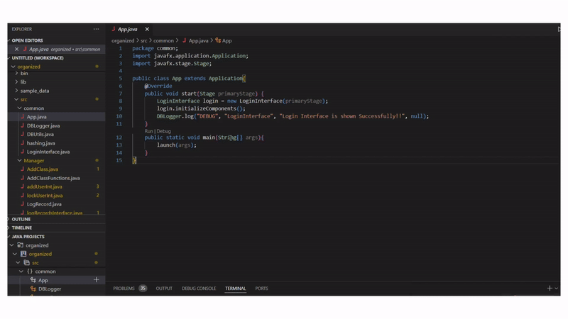
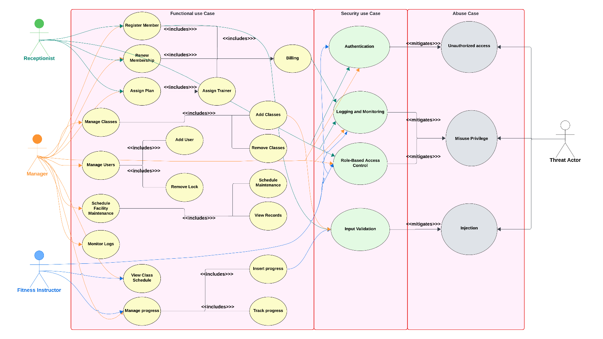
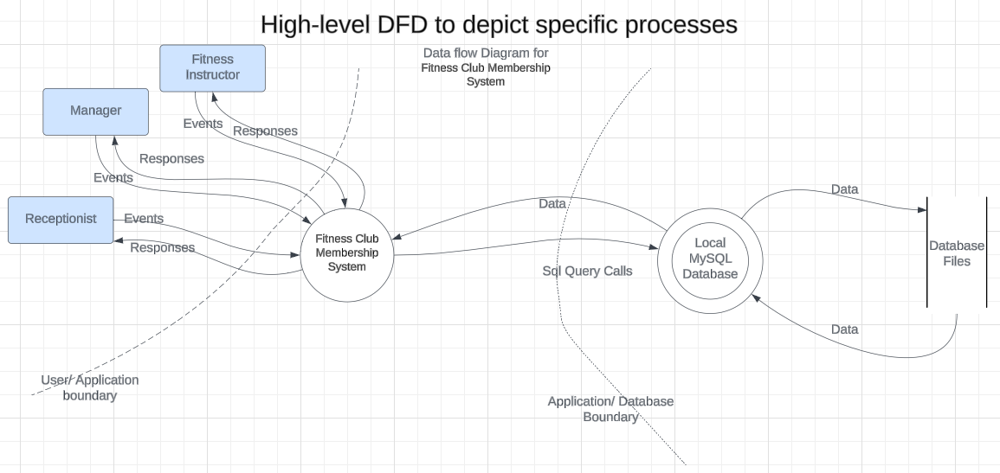
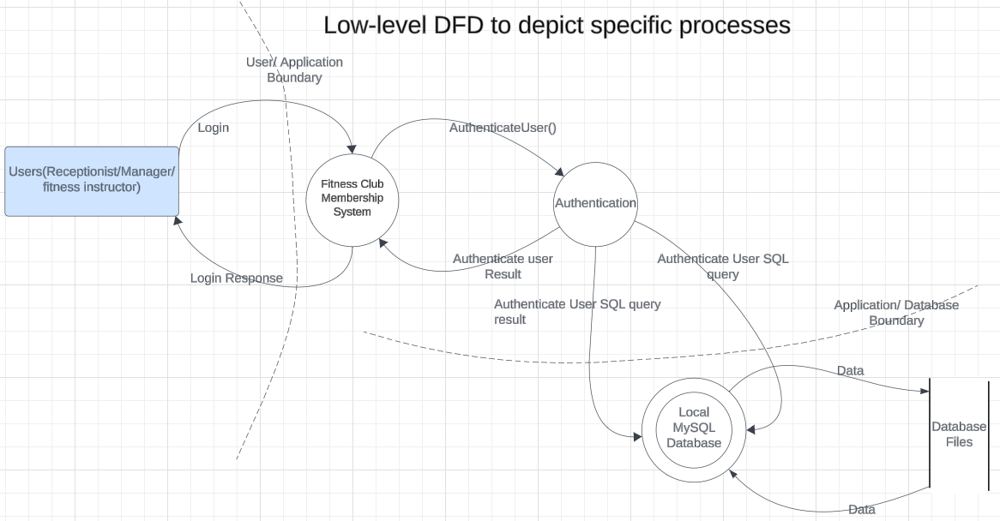
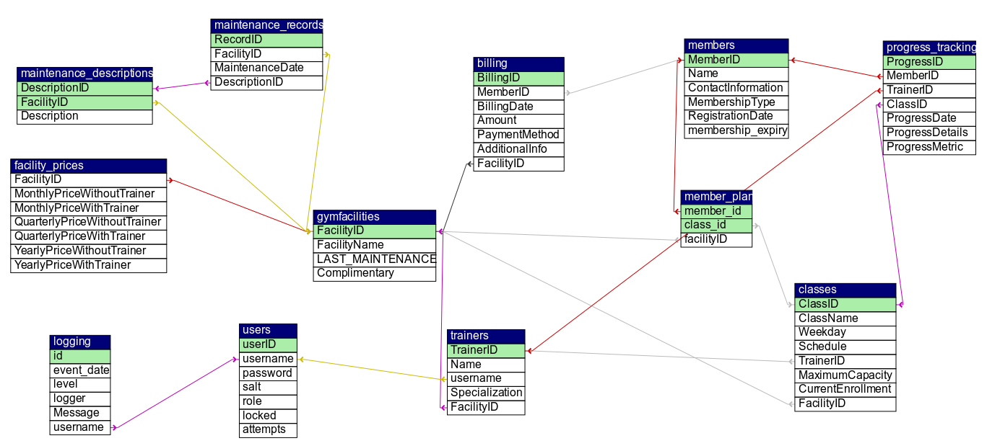

# Secure Software Development Project - Fitness Club Membership System

## Project Description

A comprehensive and secure desktop application using JavaFX designed for managing fitness club memberships. The system facilitates efficient handling of subscriptions, class schedules, and workout progress while ensuring robust security measures such as input validation, role-based access control, and prepared statements for database interactions.

## Technologies Used

- **JavaFX**
- **SQL**
- **XAMPP**

## Key Features

- Secure JavaFX software development with security throughout the SDLC.
- Input Validation and Prepared Statements.
- Role-Based Access Control (RBAC).
- Logging and Monitoring.
- Authentication and Authorization.

## Folder Structure

---

```
/demo
    demo.gif       # Demo GIF file
    demo.mp4       # Full demo video

/lib
    *.jar          # Java libraries

/screenshots
    *.png          # Screenshots

/sample_data
    *.sql          # Sample data for MySQL

/src/Manager
    *.java         # Classes related to manager interface

/src/Receptionist
    *.java         # Classes related to receptionist interface

/src/Trainer
    *.java         # Classes related to trainer interface

/src/common
    *.java         # Common classes like login, logger, hashing, etc.
    App.java       # Main application entry point

```

---

## Installation Instructions

1. Install **JavaFX** and **MySQL**.
2. Set up the database server using **XAMPP**.
3. Configure your environment for JavaFX development.
   - [JavaFX Setup Guide](https://gluonhq.com/products/javafx/)
   - [Video Tutorial](https://www.youtube.com/watch?v=AubJaosfI)

## Usage Instructions

Run src/App.java to run the application.

Click the below gif to watch the complete demo of the Application.

[](./demo/demo.mp4)

---

## Functional & Security Requirements

### Functional Requirements

1. The system allows the **Manager** to:
   - Manage facility maintenance
   - Manage users
   - Manage classes
   - Monitor logs

2. The system allows the **Receptionist** to:
   - Register members
   - Renew memberships
   - Assign plans

3. The system allows the **Fitness Instructor** to:
   - View class schedules
   - Manage member progress

### Use Case & Abuse Case Diagram


---

### Use Case Cards

| Use Case ID | Name                | Actor(s)                | Description                                | Preconditions                          | Postconditions                             |
|-------------|---------------------|-------------------------|--------------------------------------------|----------------------------------------|--------------------------------------------|
| U001        | Register Member     | Receptionist, Manager   | Register members, including billing.       | User is logged into the system.        | Membership data is updated successfully.   |
| U002        | Renew Membership    | Receptionist, Manager   | Renew existing member details and billing. | User is logged into the system.        | Membership data is updated successfully.   |
| U003        | Assign Plan         | Receptionist, Manager   | Assign a plan and trainer to a member.     | User is logged into the system.        | Plan and trainer details are updated.      |
| U004        | View Class          | Fitness Instructor, Manager | View weekly class schedules.             | User is logged into the system.        | Class schedule is displayed.               |
| U005        | Manage Progress     | Fitness Instructor, Manager | Track or update member progress.         | User is logged into the system.        | Progress data is updated successfully.     |
| U006        | Manage Classes      | Manager                 | Add or remove classes.                     | User is logged into the system.        | Class details are updated successfully.    |
| U007        | Manage Users        | Manager                 | Add or lock user accounts.                 | User is logged into the system.        | User details are updated successfully.     |
| U008        | Manage Facility Maintenance | Manager         | Schedule or view maintenance records.      | User is logged into the system.        | Maintenance records are updated.           |
| U009        | Monitor Logs        | Manager                 | View system logs.                          | User is logged into the system.        | Log data is displayed successfully.        |

---

### Security Use Case Cards

| Use Case ID | Name                        | Actor(s)       | Description                                | Preconditions                          | Postconditions                             |
|-------------|-----------------------------|----------------|--------------------------------------------|----------------------------------------|--------------------------------------------|
| S001        | Authentication and Authorization | Manager, Admin | Prevent unauthorized access.               | Admin is logged into the system.      | Users are authenticated and authorized.    |
| S002        | Role-Based Access Control (RBAC) | Admin, Manager | Restrict access based on roles.            | Admin is logged into the system.      | Role-based restrictions are enforced.      |
| S003        | Logging and Monitoring      | Admin, Manager | Track and monitor user activities.         | Admin is logged into the system.      | User activities are logged effectively.    |
| S004        | Input Validation            | Admin, Manager | Validate input to prevent injection attacks.| Admin is logged into the system.      | Input is validated successfully.           |

---

## Secure Design Principles and Threat Modeling

### Data Flow Diagrams





### Threats and Mitigations

| Threat Type               | Mitigation                                  |
|---------------------------|---------------------------------------------|
| **Spoofing**              | Strong authentication and secure storage.  |
| **Tampering**             | Hashing and RBAC.     |
| **Repudiation**           | Audit trails and timestamps.               |
| **Information Disclosure**| Encryption and strict access controls.     |
| **Denial of Service (DoS)**| Secure infrastructure.                     |
| **Privilege Escalation**  | Least privilege principle.                  |

---

## Database Structure

